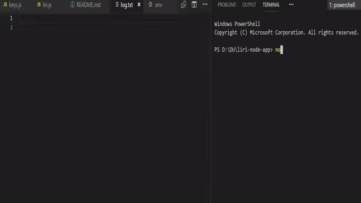

# liri-node-app

The project is created to help users find information about the band which is going to have a concert in the nearest area, find information about the specific movie or song. 

## APIs in the project
1. Bands in Town API
2. Node-Spotify-API
3. OMDB API

### Bands in Town API
The Bandsintown API is designed for enterprise partners and artists with websites, media players, and/or mobile applications that would like to list an artist’s events.
It offers read-only access to artist info and artist events:

* Artist info: returns the link to the Bandsintown artist page, the link to the artist photo, the current number of trackers and more

* Artist events: returns the list of events including their date and time, venue name and location, ticket links, lineup, description and the link to the Bandsintown event page.

### Node-Spotify-API

Based on simple REST principles, the Spotify Web API endpoints return JSON metadata about music artists, albums, and tracks, directly from the Spotify Data Catalogue.

Web API also provides access to user related data, like playlists and music that the user saves in the Your Music library. Such access is enabled through selective authorization, by the user.

### OMDB API

Use the OMDb (Open Movie Database) API to search data from the IMDb (Internet Movie Database). The API uses HTTP methods and can return data in either JSON or XML. Use the OMDb API to search for movies by title, IMDb identifier, date released, season or episode. The API also retrieves plot information and Rotten Tomatoes ratings.

## Examples

* Bands in town (node keys.js concert-this)

* Spotify (node keys.js spotify-this-song)

* OMBD (node keys.js movie-this)
